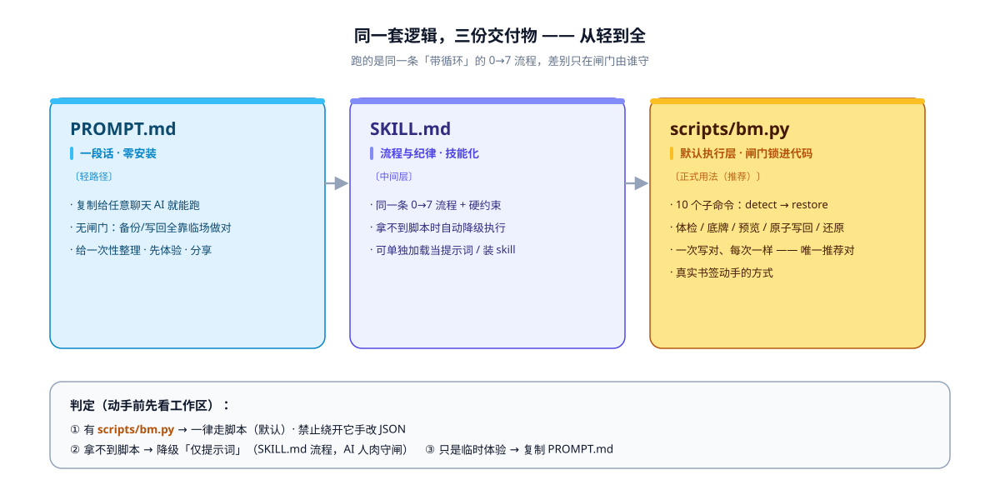
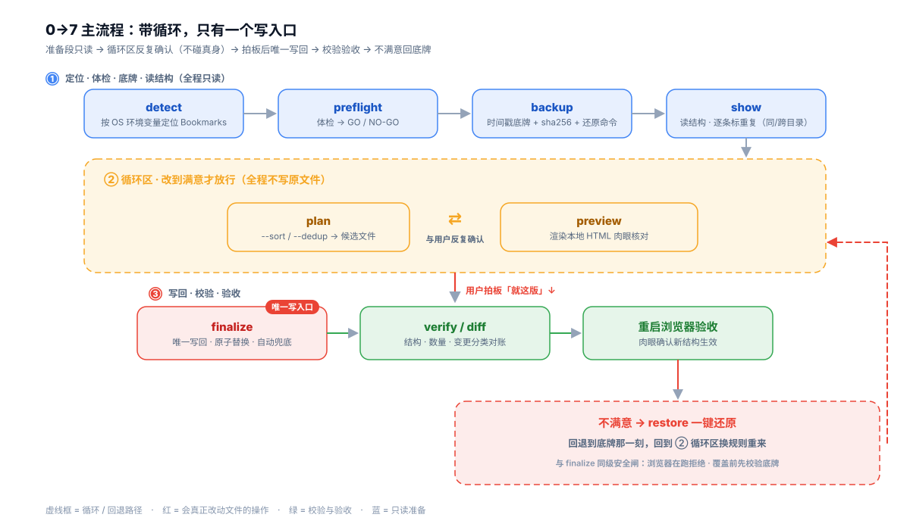

# chrome-bookmarks-organize

> **AI 整理浏览器书签栏 / 收藏夹**（Chrome、Edge）：书签太乱？让 AI 按内容自动归类、重排目录、改名、去重、排序、清理失效链接——直接编辑 Chrome/Edge 的 Bookmarks JSON 文件，**完全绕开"导出 HTML → 导入"的重复追加问题**。
> 一句话定位：**一段提示词打底，一份脚本保底——默认用脚本跑。**

[](https://github.com/LPK3215/chrome-bookmarks-organize/actions/workflows/test.yml)
[](LICENSE)
[](https://LPK3215.github.io/chrome-bookmarks-organize/)

**整理效果一眼看（`scripts/test/sample/` 通用站点演示数据）：**

```
整理前（40 条随手乱放）              整理后（38 条归入 7 个类目目录）
书签栏 ├ 10 条平铺                    书签栏 ├ 📁 购物       淘宝网 / 京东 / 拼多多 / 天猫 …
      ├ 📁 新建文件夹                  ├ 📁 新闻资讯   新浪 / 网易 / 澎湃 / 新华社 …
      ├ 📁 新建文件夹 (1)   ← 40 条   ├ 📁 技术开发   GitHub / Stack Overflow / MDN …
      ├ 📁 新建文件夹 (2)   全散落      ├ 📁 学习资源   MOOC / Coursera / 知乎 …
      └ … 无分类、重复收藏              ├ 📁 视频娱乐   bilibili / YouTube / 爱奇艺 …
                                       ├ 📁 生活工具   12306 / 高德 / 大众点评 …
                                       └ 📁 博客与阅读 少数派 / 即刻 …
                                          （同目录重复并入 1 条、失效链接删除）
```

正式整理书签，**默认 clone 本仓库走 `scripts/bm.py`（技能 + 脚本）**：体检 GO/NO-GO、自动备份、HTML 预览、原子写回、一键还原全部锁在代码里。不想 clone 时有两条轻路径——把 [`PROMPT.md`](PROMPT.md) 复制给任意 AI（一段话、无闸门，只适合一次性/先体验/分享），或只加载 [`SKILL.md`](SKILL.md) 走「仅提示词」（流程不变，闸门由 AI 人肉守）。**判定铁律：有脚本必用脚本，禁止手改 JSON。**

正式形态遵循 [Agent Skills](https://agentskills.io) 开放标准（`SKILL.md`），并附带一个离线、零第三方依赖的命令行工具箱 `scripts/bm.py`，可直接用于 Claude Code、QwenWork、OpenCode 等支持该标准的 AI 编程工具。

## 为什么做这个

整理浏览器书签的常规路线是：导出 HTML → 手工/AI 整理 → 导入。但浏览器书签的**导入是追加不是替换**，整理完永远多出一个"已导入"文件夹，还得手工去重合并。

实际上书签的底层存储就是一个**纯 JSON 文件，无加密**。直接改它 = 改正式数据，重启浏览器即生效、开同步自动同步到账号。这条路社区博客早有验证——但大多只到"一段提示词"为止，而一段话拿给 AI 全凭临场发挥：备份没强制、删了什么不透明、写坏了靠运气。本仓库把同一套逻辑做成**三份交付物，从轻到全**：

- `PROMPT.md` —— 一段话：任何 AI 都能跑的规范提示词（零安装，**无闸门**，给一次性/体验/分享）；
- `SKILL.md` —— skill 化的完整流程与纪律（先看结构 → 先提方案 → 拍板才写 → 复验 → 可还原；无脚本时的降级执行层）；
- `scripts/bm.py` —— **默认执行层**：把纪律锁进可验证的闸门（体检、自动备份、原子写回、一键还原）。



## 使用方式（默认：技能 + 脚本）

三条路跑的是**同一条 0→7 流程**（定位 → 备份 → 读结构 →〔循环改方案〕→ 拍板写回 → 校验 → 重启验收），区别只在闸门由谁守：

| 方式 | 你要做什么 | 定位 | 边界 |
|---|---|---|---|
| **技能 + 脚本**（默认 · 推荐） | clone / 下载本仓库，让 AI 调 `scripts/bm.py`：detect → preflight → backup → show → plan / preview → finalize → verify / diff → restore | 正式整理真实书签。体检、底牌、闸门、写回、校验、还原都锁在代码里，一次写对、每次一样 | 唯一推荐对真实书签动手的方式 |
| **仅技能**（无脚本时降级） | 只把 `SKILL.md` 加载进 AI（联网装 skill、或直接把文件交给 AI），不下载 `scripts/`；AI 按同一套 0→7 + 硬约束自己读写 JSON | 拿不到脚本时的兜底：流程不变，闸门由 AI 人肉守 | 没有进程探测 / sha256 校验 / HTML 预览 / 一键 restore |
| **纯提示词**（`PROMPT.md`） | 把 `PROMPT.md` 整段复制给任意聊天 AI（Claude / GPT…），再补一句"我的书签文件路径是 ……" | 不 clone、一次性小改、先体验、拿去分享 | 最轻也最裸：备份、退浏览器、删 checksum、写 UTF-8 全靠 AI 临场做对 |

判定逻辑写死在 `SKILL.md` 里：工作区有 `scripts/bm.py` → 一律走脚本（**默认**），有脚本却手改 JSON = 丢掉护栏，禁止；没有 → 自动降级仅提示词；只是临时体验 → 用 `PROMPT.md`。

## 核心：一条"带循环"的流程，不是一路走到底

```
detect 定位 → preflight 体检(GO/NO-GO) → backup 底牌 → show 读准结构
   → 〔循环区：plan 重排 → preview 预览 → 与用户反复确认，全程不动真身〕
   → 用户拍板"就这版" → finalize 写回 → verify/diff 校验 → 重启浏览器验收
   → 不满意 → restore 一键还原 → 回到循环区
```

只有 `finalize` 一步会真正改文件，其余都在内存/候选文件里折腾。



## 工具箱 `scripts/bm.py`（10 个子命令）

| 命令 | 作用 |
|---|---|
| `detect` | 按 OS 环境变量自动定位各浏览器 Profile 的 Bookmarks（**根路径不写死**，跨 Win/mac/Linux） |
| `preflight` | 只读体检：存在/可读写/JSON 合法/**浏览器进程**/**Profile 是否被占用锁**/**是否开着云端同步** → 给 **GO/NO-GO** |
| `backup` | 改前时间戳底牌 + sha256 校验 + 打印**可直接粘贴运行**的还原命令（绝对路径） |
| `show` | 打印真实结构（目录树/数量/重复 id/重复 URL/checksum）；`--depth N` 只看 N 层、`--stats` 只看体检。重复 URL 会**标出同目录还是跨目录** |
| `plan` | 内存里按 `--sort/--dedup` 重排到候选文件，**绝不碰原文件** |
| `preview` | 渲染成**本地嵌套树 HTML**（`<details>` 可折叠、无 JS），双击肉眼核对；`--base` 附「删/增/移动/改名/副本减少」差异 |
| `diff` | **路径感知**对账：除增/删 URL 外，还能识别**移动**（同名链接换目录）、改名、副本减少（删掉多份同名同链中的一份） |
| `finalize` | **唯一动真身**：先验候选与**目标**合法性（目标解析不出 `roots` 也拒，防误盖别的文件）+ 删 checksum + 改名陈旧 `.bak` + **原子写回**（先 .tmp 再 replace）；浏览器在跑/Profile 被占用拒绝（除非 `--force`），写前自动再兜一份；**`--from` 与 `--target` 同一文件则拒（防自我覆盖）**；**候选 0 条拒绝、条数暴跌 <50% 告警**（防 AI 改丢书签） |
| `verify` | JSON 合法性 + 结构合法 + id 唯一 + 数量对账；传 `--before` 时额外给出**变更分类**（删/增/移动/改名/副本减少），与 `diff` 同口径 |
| `restore` | 回退到底牌那一刻；与 `finalize` 同级安全闸（浏览器在跑拒绝）并自动兜底；**覆盖前先校验底牌**，坏底牌不碰真身 |

## 安全设计（为什么敢让它动你的真实数据）

- **写操作一律先兜底**：`finalize` 会在写回前自动复制一份 `prescript`，`restore` 也会兜一份 `prerestore`——漏做 `backup` 也不至于裸奔。
- **两个写操作同等级的安全闸**：`preflight`/`finalize`/`restore` 都有两道防线——①进程名检测（tasklist/pgrep）；②**Profile 占用锁**（`SingletonLock` 等存在即拒）。后者能回答进程名答不了的关键问题：**跑着的浏览器用的是不是这一个 Profile**，多 Profile 机器上尤其重要。
- **写回是原子的**：先落 `.tmp` 再 `os.replace`，不会留下"半个 JSON"；候选结构非法（`roots` 缺失等）直接拒绝写回。
- **预览先行**：任何写回前，先把结构渲染成本地 HTML（目录可折叠）让你肉眼核对；预览和浏览器看到的一致，才证明脚本可信。
- **不自作主张删**：去重只在同目录内合并，跨目录同链接保留；`show` 会把每条重复标成"同目录（会去重）"还是"跨目录（不去重）"，不让你猜。
- 全程**本地、离线、零依赖**，不联网、不上传。

## 第一次用不敢放心？三层自查

不要靠"相信某个工具"，按这三步自己验：

1. **先在假数据上跑一遍**：`scripts/test/sample/` 是随仓库入库的**通用站点演示样例**（before 乱放 40 条 / after 归好 38 条，全是淘宝、GitHub 这类公开站点，零隐私），跑完整个流程也碰不到你的真实数据——`diff` 的预期输出写在 `sample/README.md` 里，可以先对着看。
2. **`plan`/`preview`/`diff` 一个字节都不写进真身**，可以无限次预览到满意为止；`finalize` 是唯一写入口，且必须你明确拍板后才执行。
3. **`backup` 会当场打印一行 `restore_cmd`**（绝对路径）。这行命令在你看到它的那一刻就生效了——先把它复制到记事本存好，再继续往下走。

一句话：`restore` 的语义是**回退到底牌那一刻**，不是"只撤销最后一步"。开了浏览器同步时，底牌拍摄之后由其他设备同步来的书签也会被一并退回（详见 `SKILL.md` 的 Pitfalls），所以尽量缩短 `backup → finalize` 的间隔。

> ⚠ **云端不是备份，是复制品。** Chrome 书签同步是合并，本地的删除会跟着传播到所有设备——`preflight` 会在体检时点出这一点。唯一的保险始终是磁盘上那份底牌。详见 [阶梯式验收](MAINTENANCE.md#7-真实场景验收阶梯第一次动真-profile-之前)。

## 快速上手

**纯提示词（不下载仓库、不装技能）**：打开 [`PROMPT.md`](PROMPT.md)，把里面代码块整段复制给任意 AI，再补一句"我的书签文件路径是 ……"即可。

**仅技能（不下载仓库）**：把 `SKILL.md` 加载给 AI，说「帮我整理书签」。AI 会走仅提示词流程——先定位文件、请你关浏览器、自己拷一份备份、改完请你重启验收。细则见 `SKILL.md`「仅提示词时怎么做」。

**技能 + 脚本（默认）**（先 clone 本仓库）：

```bash
python scripts/bm.py detect                              # 找到要整理哪个
python scripts/bm.py preflight --file "<Bookmarks>"      # GO/NO-GO
python scripts/bm.py backup    --file "<Bookmarks>"      # 底牌
python scripts/bm.py show      --file "<Bookmarks>"      # 读准结构
python scripts/bm.py plan      --file "<Bookmarks>" --out cand --sort --dedup
python scripts/bm.py preview   --file cand --base "<Bookmarks>" --out preview.html
# 满意后（浏览器已退出）：
python scripts/bm.py finalize  --from cand --target "<Bookmarks>"
python scripts/bm.py verify    --file "<Bookmarks>" --before "<底牌>"
# 不满意：
python scripts/bm.py restore   --backup "<底牌>" --target "<Bookmarks>"
```

## 回归测试（改动脚本后必跑）

```bash
python scripts/test/run_tests.py     # 54 项，零第三方依赖，约 1 秒
```

它锁的是**安全不变量**，不是覆盖率：去重是否保留最新、跨目录是否被误删、`plan` 有没有写过源文件、
两个安全闸（含 Profile 占用锁）是否还拦得住、写回是否原子、结构闸门是否还生效、移动/改名/副本减少的分类对不对、
**每个命令最省参数的组合还能不能跑到底**，以及**脏输入边界**——超大门户时间戳、非 UTF-8 垃圾文件、
含引号/尖括号的名称与 URL、残缺节点结构都不会让脚本崩成"未预期错误"。

最后这条不是凑数的：`preview` 不带 `--base` 时曾因变量缺初值直接崩溃，藏了两个版本没人发现——
因为手工验证时总带着 `--base`。现在 `TestMinimumArgumentPaths` 会把每种最小参数组合都跑一遍。

这套断言做过变异验证：故意把"保留最新一条"改反，测试立刻变红——它是真的有约束力，不是摆设。
`.github/workflows/test.yml` 会在 **Windows / macOS / Linux × Python 3.9 / 3.11** 上跑同一套。

## 仓库结构

- `PROMPT.md` — **零安装轻路径**：一段可直接复制给任意 AI 的纯文本提示词（`SKILL.md` 流程的压缩版，**无闸门**）。不 clone、一次性、想先体验或分享时用它。
- `SKILL.md` — 给 AI 看的操作规范（默认脚本 + 无脚本降级 + 流程 + Pitfalls + 验证）。可单独加载当提示词，不必下载整仓。
- `scripts/bm.py` — 上述工具箱（单文件、零第三方依赖，10 个子命令）。
- `scripts/visualization/` — 架构/流程示意图的**生成脚本**（`generate_workflow.py`、`generate_deliverables.py`，零第三方依赖）。图上文案有变时，改脚本后重跑即可再生成，不要手改 SVG。
- `docs/` — 示意图成品（`workflow.svg`：0→7 带循环主流程；`deliverables.svg`：三份交付物从轻到全），由 `scripts/visualization/` 生成并入库。
- `project_overview/`（+ 根 `project_overview.html` 跳转页） — **项目全景观览站**：静态单页（简介 / 架构 / 0→7 流程 / 目录 / 快速开始 / 测试质量 / 文档索引），由 `.github/workflows/pages.yml` 在 push main 后自动发布到 GitHub Pages（见顶部徽章入口），不是 skill 运行时的组成部分。
- `scripts/test/sample/` — **入库**的通用站点演示样例：真实公开网站合成的 before（乱 40 条）/ after（归好 38 条）一对 + 生成脚本，零隐私、`clone` 后立刻有靶子可练。
- `scripts/test/run_tests.py` — 零依赖回归测试（54 项），改完 `bm.py` 请跑它。
- `scripts/test/` — **不入库**的真实书签快照（裁剪过的 `Bookmarks.before`/`after`，含隐私，已被 `.gitignore` 屏蔽），本地验证脚本手感用。
- `MAINTENANCE.md` — 长期维护文档：**AI 判断 vs 脚本执行**的分工合同、脚本质量台账、边界矩阵、变更日志。

## 使用前提（硬性）

1. **整理真实书签时浏览器必须完全退出**（含托盘后台）——这是机制限制。脚本模式由 `preflight`/`finalize` 拦截；仅提示词模式没有自动探测，必须开口确认。
2. 整理规则先与 AI 确认，**不自作主张删除任何一条书签**。

## 文件位置速查（也可直接 `detect` 自动找）

| 浏览器 | Bookmarks 路径 |
|---|---|
| Chrome (Windows) | `%LOCALAPPDATA%\Google\Chrome\User Data\<Profile>\Bookmarks` |
| Edge (Windows) | `%LOCALAPPDATA%\Microsoft\Edge\User Data\<Profile>\Bookmarks` |
| Chrome (macOS) | `~/Library/Application Support/Google/Chrome/<Profile>/Bookmarks`（无 `User Data` 层） |
| Chrome (Linux) | `~/.config/google-chrome/<Profile>/Bookmarks` |

> `<Profile>` 通常为 `Default`，多用户是 `Profile 1`…；`detect` 还能识别 Chromium/Brave/Vivaldi/Opera。

## 已知边界

- 没有"热编辑"：改文件时浏览器必须关着。
- `date_added` 是 Chrome 时间戳（自 1601-01-01 的微秒），`bm.py` 已自动转日期。
- 只管结构整理，不判断链接是否失效/内容好坏。
- `detect` 的 macOS/Linux 分支与更多浏览器内核已实现，但**尚未在非 Windows 机器上实测**。

## License

[MIT](LICENSE)
